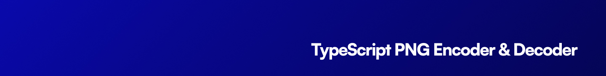

<p align="center"></p>

[![npm version][npm-version-src]][npm-version-href]
[![GitHub Actions][github-actions-src]][github-actions-href]
[](http://commitizen.github.io/cz-cli/)

# ts-svg

Pure-TypeScript SVG parser, rasterizer, and PNG encoder for Bun & Node — no native bindings, no resvg WASM, no Skia. Ships a typed element-tree API and a drop-in `Resvg`-compatible class shim.

```ts
import { svgToPng } from 'ts-svg'
import { writeFileSync } from 'node:fs'

const svg = `<svg xmlns="http://www.w3.org/2000/svg" width="200" height="80">
  <rect width="100%" height="100%" fill="#0ea5e9"/>
  <text x="100" y="50" text-anchor="middle" font-family="sans-serif" font-size="24" fill="white">ts-svg</text>
</svg>`

writeFileSync('out.png', svgToPng(svg, { scale: 2 }))
```

## Install

```bash
bun add ts-svg
# or
npm install ts-svg
```

## Features

- **Pure TS / no native deps.** Runs anywhere Bun or Node runs.
- **Drop-in `Resvg` shim.** `import { Resvg } from 'ts-svg'` replaces `@resvg/resvg-js` for the common path.
- **Typed element tree.** `parseSVG(svg)` produces `SVGRoot` you can walk, mutate, and re-serialise.
- **Analytical AA rasterizer.** 4× horizontal sub-sampling for smooth edges; non-zero fill rule.
- **Real path support.** Full `M m L l H h V v C c S s Q q T t A a Z z` grammar with adaptive cubic / quadratic / arc flattening.
- **Gradients, clip-paths, masks, `<use>`** — including `objectBoundingBox` units, `mask-type="alpha"`, and `xlink:href` chaining for gradients.
- **Stroke styling.** `stroke-width`, `stroke-linecap`, `stroke-linejoin`, `miter-limit`, `dasharray` + `dashoffset`.
- **Bunfig-powered config.** Drop a `svg.config.ts` next to your `package.json` and library defaults pick it up automatically.

## API

### Convenience pipeline

```ts
import { svgToPng } from 'ts-svg'
const png: Buffer = svgToPng(svgString, { scale: 2 })
```

### Element tree

```ts
import { parseSVG, rasterize, encodePng } from 'ts-svg'

const root = parseSVG(svgString)        // typed SVGRoot
const fb = rasterize(root, { scale: 2 }) // Framebuffer (RGBA Uint8Array)
const png = encodePng(fb)                // Buffer
```

### Resvg-compatible shim

```ts
import { Resvg } from 'ts-svg'

const resvg = new Resvg(svgString, {
  fitTo: { mode: 'width', value: 1024 },
  background: '#fff',
})
const img = resvg.render()
img.width()      // number
img.height()     // number
img.pixels()     // Uint8Array (RGBA, top-to-bottom; copy of the framebuffer)
img.asPng()      // Buffer
```

`fitTo.mode` accepts `'original'`, `'zoom'`, `'width'`, or `'height'`. The shim caches the parsed tree, so calling `render()` twice doesn't re-parse.

### `RenderOptions`

| key | type | default | notes |
| --- | --- | --- | --- |
| `width` | `number` | intrinsic | Output width in px (overrides `scale`). |
| `height` | `number` | intrinsic | Output height in px (overrides `scale`). |
| `scale` | `number` | `1` | Multiplier on the SVG's intrinsic size. |
| `background` | `string \| RGBA` | transparent | CSS color or RGBA literal. |
| `tolerance` | `number` | `0.25` | Bezier flattening tolerance in user units. |
| `currentColor` | `string` | `black` | Resolves `currentColor` references. |
| `fontResolver` | `FontResolver` | — | Function that maps `font-family` to a font; without it `<text>` is skipped. |

## CLI

```bash
ts-svg render logo.svg -o logo.png --scale 2
ts-svg render logo.svg --width 1024 --background "#fff"
ts-svg to-png logo.svg
```

## Configuration

Create `svg.config.ts` in your project root:

```ts
import type { SvgConfig } from 'ts-svg'

const config: Partial<SvgConfig> = {
  tolerance: 0.5,        // coarser flattening for huge documents
  background: '#ffffff',
  currentColor: '#1f2937',
  maxUseDepth: 8,
  verbose: true,
}

export default config
```

Powered by [bunfig](https://github.com/stacksjs/bunfig). The file is auto-discovered at import time.

## Scope

- **Supported:** `svg`, `g`, `defs`, `rect`, `circle`, `ellipse`, `line`, `polygon`, `polyline`, `path`, `text` (with a font resolver), `use`, `linearGradient`, `radialGradient`, `clipPath`, `mask`.
- **Out of scope (today):** `<style>`/CSS selectors, `<filter>` (no Gaussian blur etc.), `<image>`, `<pattern>`, `<symbol>` advanced semantics, `<tspan>` per-glyph positioning.

## Testing

```bash
bun test
```

The `fixtures.test.ts` suite asserts pixel-level structural facts (specific colours at specific coordinates) for every supported element so regressions are caught immediately.

## Changelog

Please see our [releases](https://github.com/stacksjs/ts-svg/releases) page for more information on what has changed recently.

## Contributing

Please see [CONTRIBUTING](.github/CONTRIBUTING.md) for details.

## License

The MIT License (MIT). Please see [LICENSE](LICENSE.md) for more information.

Made with 💙

<!-- Badges -->
[npm-version-src]: https://img.shields.io/npm/v/ts-svg?style=flat-square
[npm-version-href]: https://npmjs.com/package/ts-svg
[github-actions-src]: https://img.shields.io/github/actions/workflow/status/stacksjs/ts-svg/ci.yml?style=flat-square&branch=main
[github-actions-href]: https://github.com/stacksjs/ts-svg/actions?query=workflow%3Aci
